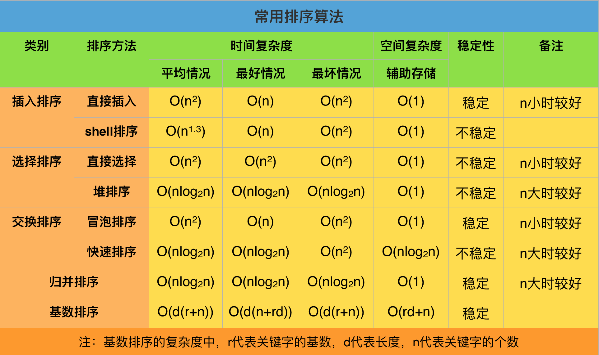

稳定与非稳定:

如果一个排序算法能够保留数组中重复元素的相对位置则可以被称为是 稳定 的。反之，则是 非稳定 的。

直接插入排序 
从第一个元素开始，该元素可以认为已经被排序
取出下一个元素，在已经排序的元素序列中从后向前扫描
如果该元素（已排序）大于新元素，将该元素移到下一位置
重复步骤3，直到找到已排序的元素小于或者等于新元素的位置
将新元素插入到该位置后
重复步骤2~5

希尔排序 也称 递减增量排序算法，是插入排序的一种更高效的改进版本。希尔排序是 非稳定排序算法。

希尔排序是基于插入排序的以下两点性质而提出改进方法的：

插入排序在对几乎已经排好序的数据操作时，效率高，即可以达到线性排序的效率
但插入排序一般来说是低效的，因为插入排序每次只能将数据移动一
希尔排序是先将整个待排序的记录序列分割成为若干子序列分别进行直接插入排序，待整个序列中的记录“基本有序”时，再对全体记录进行依次直接插入排序。

基本思想
将待排序数组按照步长gap进行分组，然后将每组的元素利用直接插入排序的方法进行排序；每次再将gap折半减小，循环上述操作；当gap=1时，利用直接插入，完成排序。

可以看到步长的选择是希尔排序的重要部分。只要最终步长为1任何步长序列都可以工作。一般来说最简单的步长取值是初次取数组长度的一半为增量，之后每次再减半，直到增量为1。更好的步长序列取值可以参考维基百科。

算法描述
选择一个增量序列 t1，t2，……，tk，其中 ti > tj, tk = 1；
按增量序列个数 k，对序列进行 k 趟排序；
每趟排序，根据对应的增量 ti，将待排序列分割成若干长度为 m 的子序列，分别对各子表进行直接插入排序。仅增量因子为 1 时，整个序列作为一个表来处理，表长度即为整个序列的长度。
效果如下：

简单选择排序
基本思想
选择排序（Selection sort）是一种简单直观的排序算法。
它的工作原理如下。首先在未排序序列中找到最小（大）元素，存放到排序序列的起始位置，
然后，再从剩余未排序元素中继续寻找最小（大）元素，
然后放到已排序序列的末尾。以此类推，直到所有元素均排序完毕。

选择排序的主要优点与数据移动有关。
如果某个元素位于正确的最终位置上，
则它不会被移动。选择排序每次交换一对元素，
它们当中至少有一个将被移到其最终位置上，
因此对 n个元素的表进行排序总共进行至多 n-1 次交换。
在所有的完全依靠交换去移动元素的排序方法中，选择排序属于非常好的一种。

堆排序
https://images.morethink.cn/heap_sort_gif.gif